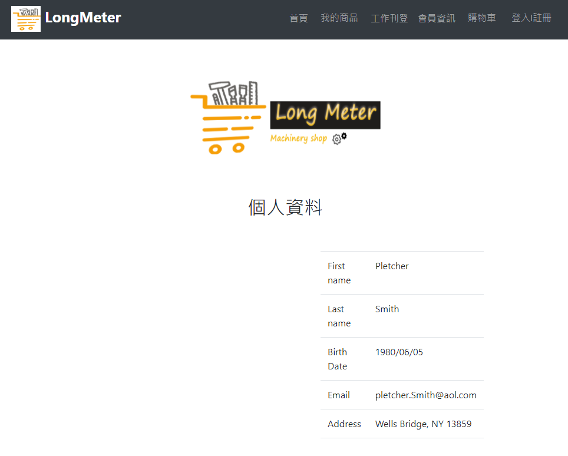
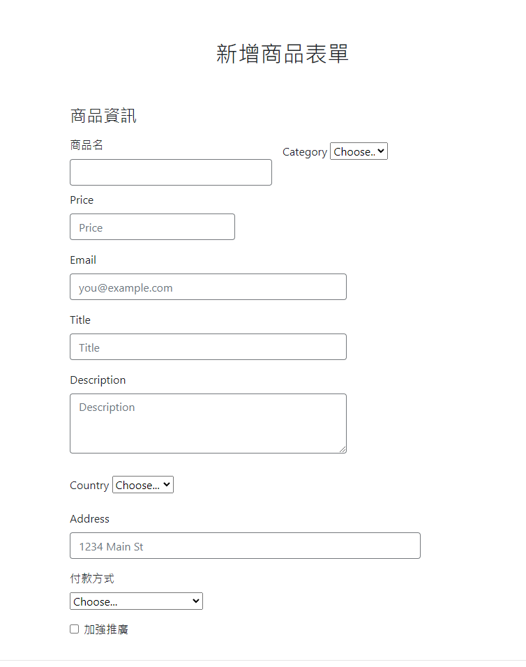
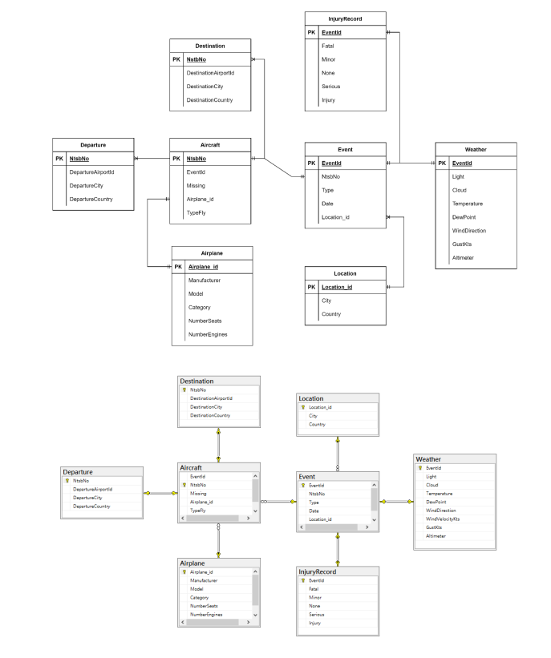

# Web_Equipment-Rental-Website

This project is a three-tier web application designed to improve the process of matching construction equipment rentals and drivers in the construction industry. Whether you're a construction company, an engineer, a construction equipment supplier, or a skilled driver, our platform provides a convenient way to meet your needs.

## Key Features:

- User-Friendly Interface: A clean and intuitive user interface allows you to easily browse through various construction equipment and driver listings, as well as input your specific requirements.
- Database and Relational Database Management: Our platform leverages a powerful relational database to store and manage data related to construction equipment, drivers, and users. This enables efficient storage and retrieval of extensive data while establishing relationships between equipment and drivers.
- Matching System: A robust matching system analyzes your requirements and automatically matches the most suitable equipment and drivers, saving you time and effort.
- Supplier and Driver Management: We offer supplier and driver personal data management interfaces to simplify their operations and provide an effective way to find job opportunities.
- Incorporating a relational database into our platform ensures efficient data management and seamless connections between equipment and drivers, enhancing the overall user experience.
Feel free to visit our website and experience a simpler and more efficient way to manage your construction business needs!

